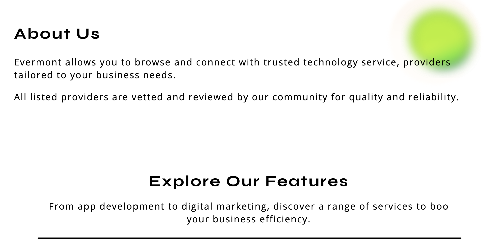

# Evermont landing page

A static landing page for Evermont, a concept for connecting businesses with technology service providers. It uses HTML, CSS, and a small amount of JavaScript for the mobile menu and expandable feature descriptions.

## Run locally

Open `index.html` in a browser. No build step or dependencies are required.

The contact form is a front-end demo; it does not send messages to a server.

## Screenshots

The screenshots are stored in [`screenshots/`](screenshots/). These relative image paths work when viewing this README in the repository.

### Hero

### About

### Features

### How it works and contact

## Project files

- `index.html` — page content
- `index.css` — layout and styling
- `index.js` — menu, feature toggles, and demo form behavior
- `assets/` — images used by the page
- `screenshots/` — README previews
